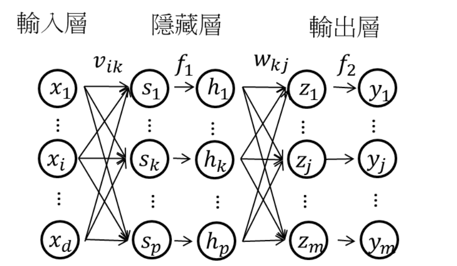

# (DNN)

## Multilayer perceptron(MLP)

傳統的定義:  
Multilayer perceptron 是一種前向傳遞類神經網路  
至少包含三層 layer(Input layer, Hidden layer, Output layer)並且利用到「倒傳遞」的技術達到 Model learning 的 supervised learning
現在 Deep learning 的發展其實 MLP 是 Deep neurla network(DNN)的一種 special cases 概念上基本一樣
只是 DNN 在學習過程中多了一些手法和層數會更多更深  
%20network.png> "Multilayer perceptron")  

- 前向傳遞(Forward propagation):較簡單 只有線性合成 和非線性轉換

- 反向傳遞(Backward propagation)較複雜 因為多微分方程

### Forward propagation

# Reference

[Multilayer perceptron(MLP) 含 Backward propagation 詳細推導](https://hackmd.io/@wayne0509/ryTVXpmMw)
