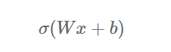

# Machine Learning

| Topic |                               Link                               |
| :---: | :--------------------------------------------------------------: |
|  CNN  | [README.md](<./Convolutional%20Neural%20Network(CNN)/README.md>) |
|  DNN  |     [README.md](<./Deep%20Neural%20Network(DNN)/README.md>)      |
|  RNN  |   [README.md](<./Recurrent%20Neural%20Network(RNN)/README.md>)   |

## Activation Function

Activation Function 在 nerual network、deep learning 中是很重要的角色 基本上由此式子組成  


其中 Wx 的矩陣是常見的 Linear operation 不過`Wx + b`嚴格來說是稱為 affine operation(仿射運算 相對應線性空間)  
activation function 會提供 NN 模型非線性的特性


所以建構 NN 所使用的 activation functions 通常是非線性的  
最重要的目的就是為模型加入非線性的特性 透過非線性的 activation functions 的推疊 模型可以捕捉到複雜的資料背後蘊含的規則

### 常見的 activation functions 類型:


Features:

- 1.可微分且有平滑的 gradient
- 2.輸出範圍為 0~1，輸入數值越大（正值）則輸出越接近 1，輸入數值越小（負值）則輸出越接近 0，因此適合做為機率預測模型的輸出層
- 3.當輸入數值大於或小於一定的範圍時，sigmoid 的輸出差異不大，因此 gradient 極小，這會導致訓練模型時遭遇梯度消失（vanishing gradients）的問題。這樣的問題在深度模型會更明顯，因為變化極大的輸入經過多次的壓縮到很小的輸出範圍，gradient 更可能小到無法有效訓練模型


Features:

- 可微分且有平滑的 gradient
- 與 sigmoid 相似，但輸出範圍為 -1~1。由於輸出以 0 為中心，適合用在預測正向、中性與負向關係模型的輸出層。另外用於 hidden layers 時可以將輸入標準化（normalization）且以 0 為中心，據說（？）有助於後面的 layers 的學習
- 另一個與 sigmoid 相似的點是 tanh 也會遭遇梯度消失（vanishing gradients）的問題，儘管 tanh 的 gradient 已經比 sigmoid 的 gradient 更陡峭


Features:

- 只將大於 0 的輸入維持原樣輸出，小於 0 的輸入全都轉換為 0。可以想成只在輸入大於 0 時 activated，計算上比較有效率
- 不會飽和（non-saturating）的特性可免於梯度消失（vanishing gradients）的問題，使得模型更容易收斂，是目前很常使用的 activation function
- 如果輸入都是負的，將會全部被轉換為 0，使得梯度為 0，因此部分的 weights 和 biases 就無法被更新，進而可能使得 neurons 成為永遠不會 activated 的 dead neurons，這會讓訓練模型缺乏效率（Dying ReLU Problem）

  
  
Features:

- 將一個數值陣列轉換為總合為 1 的機率分布，適合做為多類別分類（multi-class classification）模型的輸出層

### 如何選擇 activation function

|                                                    Hidden layers                                                    |                                                                          Output layer                                                                          |
| :-----------------------------------------------------------------------------------------------------------------: | :------------------------------------------------------------------------------------------------------------------------------------------------------------: |
|                        一般同一個模型的所有 hidden layers 都會使用同一種 activation function                        |                                                           二元分類（Binary classification）：Sigmoid                                                           |
|                          通常會選擇最常使用的 ReLU 開始嘗試，視是否達到預期成果再進行調整                           |                                                        多類別分類（Muticlass classification）：Softmax                                                         |
| 避免在非常多層的 network 的 hidden layers 使用 sigmoid 或 tanh，否則很可能遭遇梯度消失（vanishing gradients）的問題 | 多標籤分類（Multilabel classification）：Sigmoid，預測結果可能多於一個 labels，因此每個類別以 0 到 1 的機率個別表示該類別是 label 的機率，所有機率不須總和為 1 |
|                           聽說（？） swish 適合用於超過 40 層的 networks，有機會想試試看                            |                                                             輸出數值的正負代表正向及負向意義：Tanh                                                             |

## Machine Learning steps

ML = Regression + Classification + Structured  
Learning(create something with structure)

### Step 1. Function with unknown

**_Model:_**

```
y=b+wx
```

### Step 2. Define Loss from Training data

Loss is afunction of parameters e.g. L(b,w)  
 Loss: L=1/N( Σ(e) ) e 為每筆資料的預設跟實際的誤差，N 為總資料數  
 Loss 越大代表參數越差  
 計算誤差的方式:  
 e=|y-y'| L is mean absolute error(MAE)  
 e=(y-y')^2 L is mean square error(MSE)  
 如果 y 為機率表示的話=>Cross-entropy

### Step 3. Optimization

Grandient Descent  
 

- (Randomly) Pick an initial value "w1"
- Compute L'/w'| w=w1 , Negative=> Increase Positive=>decrease w
- Update w iteratively

  


## Cross-entropy

cross-entropy 是用來觀測預測的機率分布與實際機率分布的誤差範圍  
corss-entropy 越高，代表內涵的資訊量越大，不確定越多，誤差越高  
[何謂 Cross-Entropy (交叉熵)](https://r23456999.medium.com/%E4%BD%95%E8%AC%82-cross-entropy-%E4%BA%A4%E5%8F%89%E7%86%B5-b6d4cef9189d)

## Neuron


記得要整理 Neuron: wefuhweiufhewpifuewhileuhfweuifhweifuwehpf654
""1!2 #
https://cvfiasd.pixnet.net/blog/post/275774124-%E6%B7%B1%E5%BA%A6%E5%AD%B8%E7%BF%92%E6%BF%80%E5%8B%B5%E5%87%BD%E6%95%B8%E4%BB%8B%E7%B4%B9

## Model bias and optimization issue

### How do you identity overfitting?


### How do you restrict access to a course in modules?

- Less parameters sharing parameters
- Less features
- Early stopping
- Regularization
- Dropout

# Learning source:

[1. Machine Learning 2021 李弘毅教授](https://www.youtube.com/@HungyiLeeNTU)  
[2. Machine Learning Implementation](https://www.tutorialspoint.com/machine_learning/machine_learning_implementing.htm)  
[3. Machine Learning 3 小時 實作](https://www.youtube.com/watch?v=wm9yR1VspPs)  
[4. Machine Learning 2021 spring](https://speech.ee.ntu.edu.tw/~hylee/ml/2021-spring.php)  
[5. build sequential model](https://ithelp.ithome.com.tw/articles/10224345)

# Reference:

[\*Args and \*\*Kwargs in Python](https://www.youtube.com/watch?v=4jBJhCaNrWU&t=19s)  
[理解 numpy 中的 meshgrid()方法](https://wangyeming.github.io/2018/11/12/numpy-meshgrid/)  
[資料分析 & 機器學習](https://medium.com/jameslearningnote/%E8%B3%87%E6%96%99%E5%88%86%E6%9E%90-%E6%A9%9F%E5%99%A8%E5%AD%B8%E7%BF%92-%E7%AC%AC2-2%E8%AC%9B-%E5%A6%82%E4%BD%95%E7%8D%B2%E5%8F%96%E8%B3%87%E6%96%99-google-map-api-beb7c88dc4e3)  
[How to build a machine learning model](https://towardsdatascience.com/how-to-build-a-machine-learning-model-439ab8fb3fb1)  
[Keras sequential vs functional API](https://www.youtube.com/watch?v=EvGS3VAsG4Y)  
[EarlyStopping Callbacks](https://cynthiachuang.github.io/EarlyStopping-Callback/)  
[Activation Function 怎麼影響模型](https://yuehhua.github.io/2018/07/27/activation-function/)  
[深度學習基本概念(數學)：Activation functions ](https://medium.com/@yingyuchentw003/%E6%B7%B1%E5%BA%A6%E5%AD%B8%E7%BF%92%E5%9F%BA%E6%9C%AC%E6%A6%82%E5%BF%B5-activation-functions-8d890d650e8a)  
[Activation Function 是甚麼?](https://medium.com/%E6%B7%B1%E6%80%9D%E5%BF%83%E6%80%9D/ml08-activation-function-%E6%98%AF%E4%BB%80%E9%BA%BC-15ec78fa1ce4)
