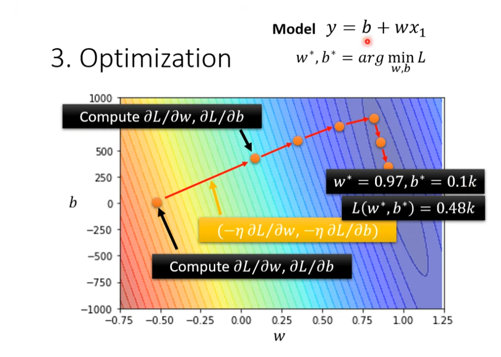

# Machine Learning

ML = Regression + Classification + Structured Learning(create something with structure)

## Machine Learning steps

### Step 1. Function with unknown

**_Model:_**

```
y=b+wx
```

### Step 2. Define Loss from Training data

Loss is afunction of parameters e.g. L(b,w)  
 Loss: L=1/N( Σ(e) ) e 為每筆資料的預設跟實際的誤差，N 為總資料數  
 Loss 越大代表參數越差  
 計算誤差的方式:  
 e=|y-y'| L is mean absolute error(MAE)  
 e=(y-y')^2 L is mean square error(MSE)  
 如果 y 為機率表示的話=>Cross-entropy

### Step 3. Optimization

Grandient Descent  
 

- (Randomly) Pick an initial value "w1"
- Compute L'/w'| w=w1 , Negative=> Increase Positive=>decrease w
- Update w iteratively

  


## Cross-entropy

cross-entropy 是用來觀測預測的機率分布與實際機率分布的誤差範圍  
corss-entropy 越高，代表內涵的資訊量越大，不確定越多，誤差越高  
[何謂 Cross-Entropy (交叉熵)](https://r23456999.medium.com/%E4%BD%95%E8%AC%82-cross-entropy-%E4%BA%A4%E5%8F%89%E7%86%B5-b6d4cef9189d)

## Neuron


記得要整理 Neuron: wefuhweiufhewpifuewhileuhfweuifhweifuwehpf654
""1!2 #
https://cvfiasd.pixnet.net/blog/post/275774124-%E6%B7%B1%E5%BA%A6%E5%AD%B8%E7%BF%92%E6%BF%80%E5%8B%B5%E5%87%BD%E6%95%B8%E4%BB%8B%E7%B4%B9

## Model bias and optimization issue

How do you identity overfitting?  


# 學習順序:

[1. Machine Learning 2021 李弘毅教授](https://www.youtube.com/@HungyiLeeNTU)  
[2.. Machine Learning Implementation](https://www.tutorialspoint.com/machine_learning/machine_learning_implementing.htm)  
[3. Machine Learning 3 小時 實作](https://www.youtube.com/watch?v=wm9yR1VspPs)  
[4. Applied Deep Learning(ADL) 2022 陳縕儂教授](https://www.youtube.com/watch?v=wm9yR1VspPs)

# 參考資料:

[\*Args and \*\*Kwargs in Python](https://www.youtube.com/watch?v=4jBJhCaNrWU&t=19s)  
[理解 numpy 中的 meshgrid()方法](https://wangyeming.github.io/2018/11/12/numpy-meshgrid/)
[資料分析 & 機器學習](https://medium.com/jameslearningnote/%E8%B3%87%E6%96%99%E5%88%86%E6%9E%90-%E6%A9%9F%E5%99%A8%E5%AD%B8%E7%BF%92-%E7%AC%AC2-2%E8%AC%9B-%E5%A6%82%E4%BD%95%E7%8D%B2%E5%8F%96%E8%B3%87%E6%96%99-google-map-api-beb7c88dc4e3)
