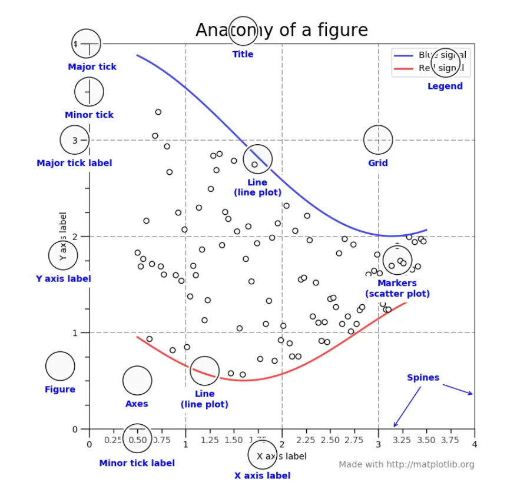

## About matplotlib structure

  
(來源: https://matplotlib.org/1.5.1/faq/usage_faq.html#parts-of-a-figure)

- Figure:指的是畫布 當我們要畫圖時需要先創建一個畫布 才能在上面加各種元素

```
fig = plt.figure()
```

### Axes:

- axis 是指 x 軸、y 軸 而 axes 指的是負數形式(two dimentional 有兩個 zxis、three dimentional 有三個)
- Figure 為畫布 axes 就是要放到畫布上的任何物體
- 每次我們在 Figure 中增加一個 subplot 就是增加一套 axis
- 所以今天 Figure 中只有一張圖 那 ax 和 plt 控制的圖片就是一樣的 效果也是
- Axis: ax.axis , ax.yaxis
- 每個 axis 由豎線和數字構成(刻度&值) 每個豎線也為一個 axis 的 subplot 所以 ax.axis 也有 axes 這個對象 對每個 axes 進行編輯就會影響 xaxis 圖上的樣子

  
(來源: https://matplotlib.org/stable/users/explain/quick_start.html)

### What are the different between plt and ax?

- plt.figure():這是 matplotlib 所提供的一個 api 可以快速地透過 plt.來畫圖 但如果想要更細緻 也就是控制到更細的部分來畫圖 就要使用第二種方式
- fig,ax=plt.subplots():透過指定 figure 和 axes 來進行畫圖 對 axes 進行單獨更細緻的操作
